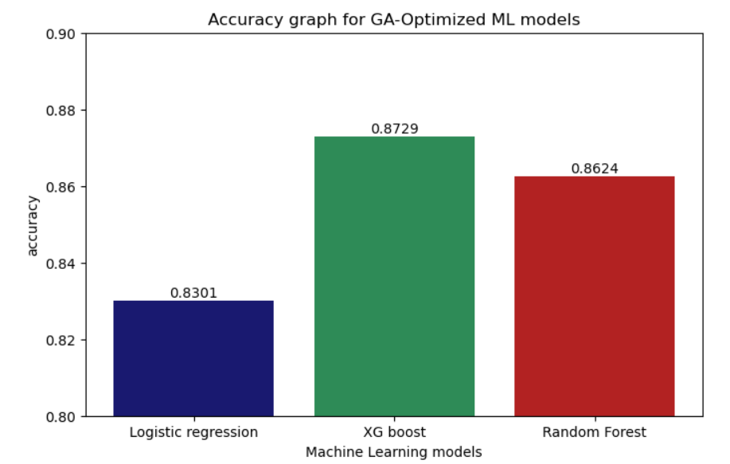
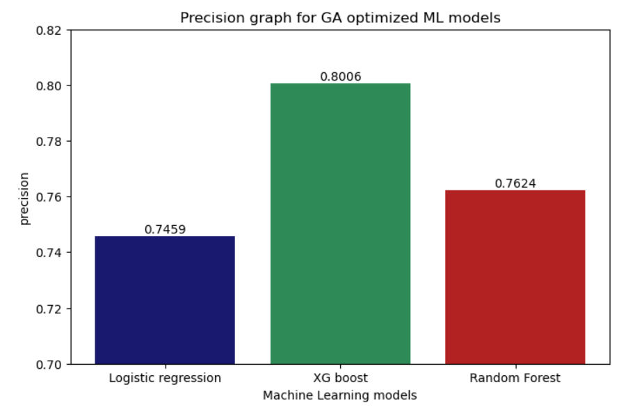
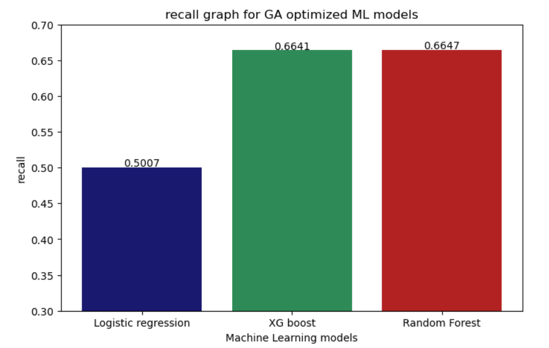
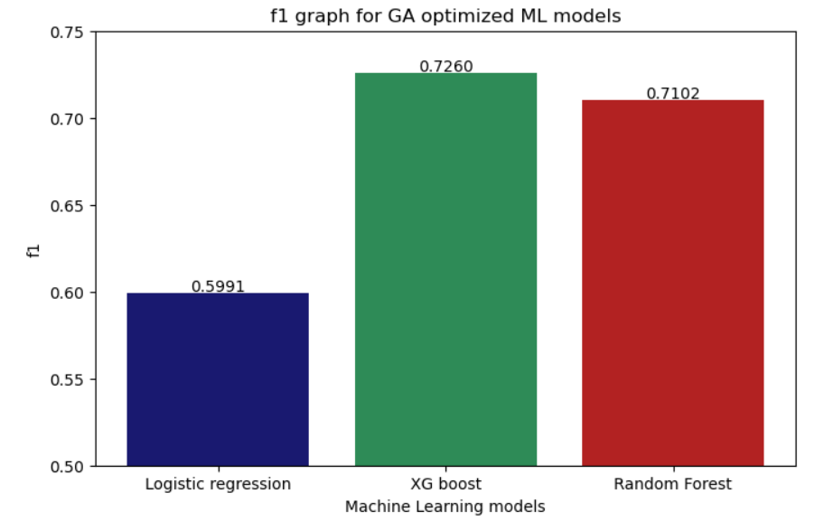
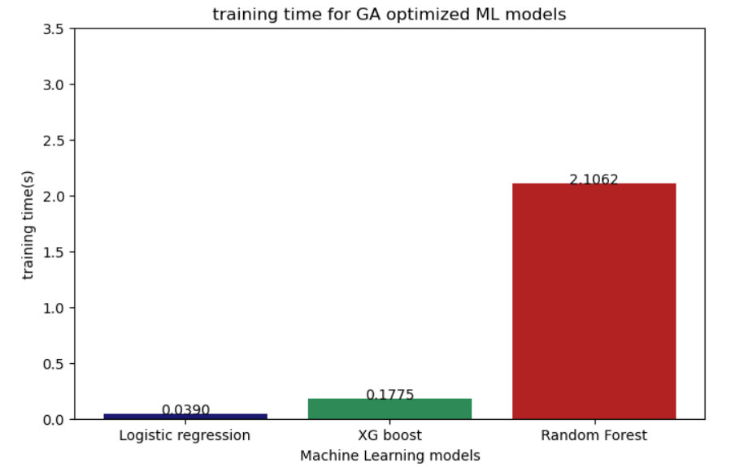
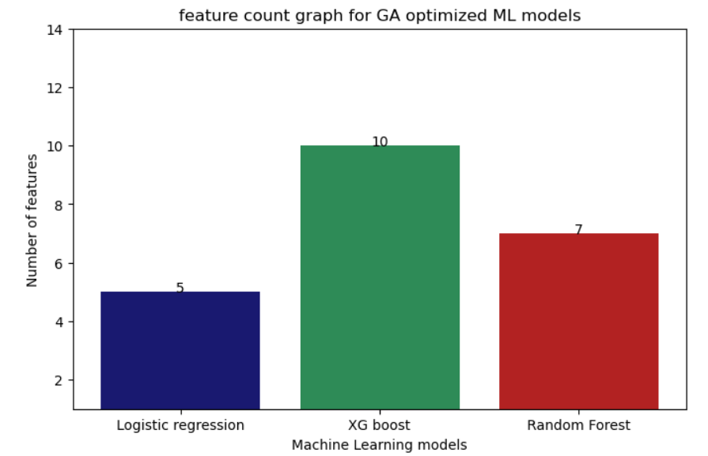
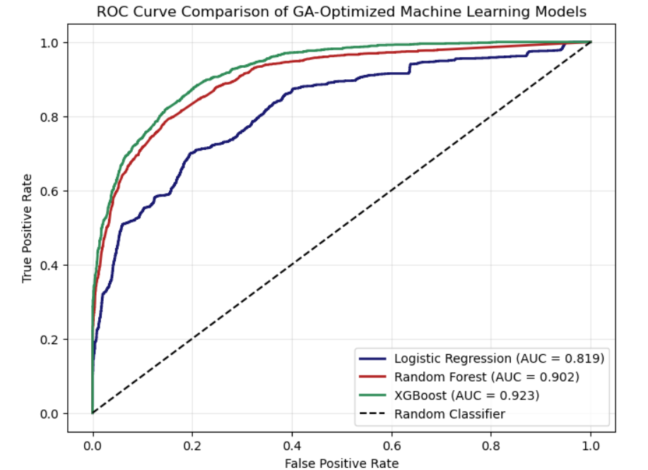
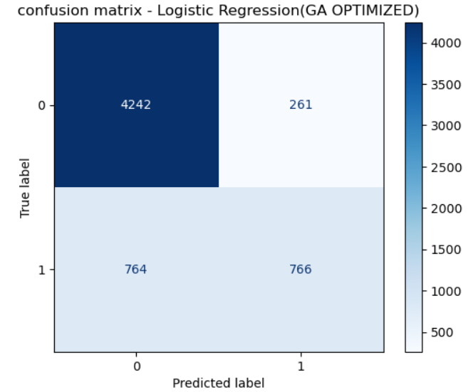
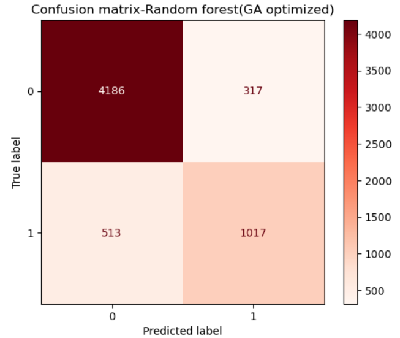
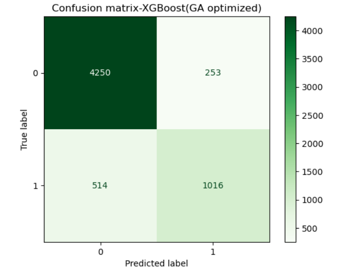

# Evolutionary Feature Selection Using Genetic Algorithms for Optimizing Multiple Machine Learning Models

## 📌 Project Overview

This project presents a comparative study of multiple machine learning models for predicting income levels using the Adult Income Census dataset. The primary objective is to investigate the effectiveness of **Genetic Algorithm (GA)-based evolutionary feature selection** in improving model performance while reducing the number of input features.

Three machine learning algorithms were implemented and evaluated:

* Logistic Regression
* Random Forest
* XGBoost

Each model was trained using the original feature set and then optimized using a Genetic Algorithm. Hyperparameter tuning was also performed and compared with the GA approach to determine the most effective optimization technique.

---

# 🎯 Objectives

* Predict whether an individual's annual income exceeds $50K.
* Compare the performance of multiple machine learning models.
* Apply Genetic Algorithm for evolutionary feature selection.
* Compare GA with Hyperparameter Tuning.
* Evaluate models using multiple performance metrics.

---

## 📂 Dataset

- **Dataset Name:** Adult Income Census Dataset
- **Source:** UCI Machine Learning Repository
- **Target Variable:** Income (<=50K / >50K)
- **Type:** Binary Classification
---
# ⚙️ Technologies Used

- Python
- Jupyter Notebook
- NumPy
- Pandas
- Matplotlib
- Scikit-learn
- XGBoost
- PyGAD
- Genetic Algorithm (GA)
- RandomizedSearchCV

---

# 🧬 Methodology

The project follows the complete machine learning pipeline:

1. Data Preprocessing
2. Handling Missing Values
3. Feature Encoding
4. Feature Scaling
5. Train-Test Split
6. Baseline Model Training
7. Genetic Algorithm Feature Selection
8. Hyperparameter Tuning
9. Model Evaluation
10. Comparative Analysis with table and graphs

---

# 🤖 Machine Learning Models

* Logistic Regression
* Random Forest Classifier
* XGBoost Classifier

---

# 📊 Evaluation Metrics

The models were evaluated using:

* Accuracy
* Precision
* Recall
* F1 Score
* Training time(s)
* Confusion Matrix
* ROC Curve
* Area Under Curve (AUC)

---

# 🏆 Final Results

| Model                    |   Accuracy |  Precision |     Recall |   F1 Score | Features |
| ------------------------ | ---------: | ---------: | ---------: | ---------: | -------: |
| Logistic Regression (GA) | **83.01%** | **74.59%** | **50.07%** | **59.91%** |        5 |
| Random Forest (GA)       | **86.24%** | **76.24%** | **66.47%** | **71.02%** |        7 |
| **XGBoost (GA)**         | **87.29%** | **80.06%** | **66.41%** | **72.60%** |       10 |

**Best Model:** **GA-Optimized XGBoost**

---
# 📈 Results Visualization

## Accuracy Comparison

<p align="center">
  
</p>

---

## Precision Comparison

<p align="center">
  
</p>

---

## Recall Comparison

<p align="center">
  
</p>

---

## F1 Score Comparison

<p align="center">
  
</p>

---

## Training Time Comparison

<p align="center">
  
</p>

---

## Feature Count Comparison

<p align="center">
  
</p>

---

## ROC Curve Comparison

<p align="center">
  
</p>

---

## Confusion Matrix - Logistic Regression

<p align="center">
  
</p>

---

## Confusion Matrix - Random Forest

<p align="center">
  
</p>

---

## Confusion Matrix - XGBoost

<p align="center">
  
</p>
---

# 📈 Project Workflow

```text
Adult Income Dataset
        │
        ▼
Data Preprocessing
        │
        ▼
Feature Encoding & Scaling
        │
        ▼
Train-Test Split
        │
        ▼
Baseline Models
        │
        ▼
Genetic Algorithm Feature Selection
        │
        ▼
Hyperparameter Tuning
        │
        ▼
Performance Evaluation
        │
        ▼
Comparison of Models
```

---

# 📁 Repository Structure

```text
GA-Based-Feature-Selection-for-Income-Prediction/
│
├── Income_Prediction.ipynb
├── Adult_Income.csv
├── README.md
├── requirements.txt
│
└── images/
    ├── accuracy.png
    ├── precision.png
    ├── recall.png
    ├── f1_score.png
    ├── training_time.png
    ├── feature_count.png
    ├── confusion_matrix_lr.png
    ├── confusion_matrix_rf.png
    ├── confusion_matrix_xgb.png
    └── roc_curve.png
```

---

# 🚀 How to Run

1. Clone the repository.

```bash
git clone https://github.com/RejuthaSree/GA-Based-Feature-Selection-for-Income-Prediction.git
```

2. Install the required libraries.

```bash
pip install -r requirements.txt
```

3. Open the notebook.

```bash
jupyter notebook Income_Prediction.ipynb
```

---

# 🔮 Future Scope

* Implement advanced optimization techniques such as Bayesian Optimization and Optuna.
* Compare additional ensemble models such as LightGBM and CatBoost.
* Deploy the final model using Flask or Streamlit.
* Evaluate the framework on larger and more diverse real-world datasets.

---

# 👨‍💻 Author

**Rejuthasree M**

---

# ⭐ Project Highlights

* ✅ Evolutionary Feature Selection using Genetic Algorithm
* ✅ Comparative Analysis of Three ML Models such as Logistic Regression, XGBoost and Random forest
* ✅ Hyperparameter Tuning Comparison
* ✅ Evaluation using ROC, AUC, Confusion Matrix, and Performance Metrics
* ✅ Best Accuracy Achieved: **87.29%** using **GA-Optimized XGBoost**

---

